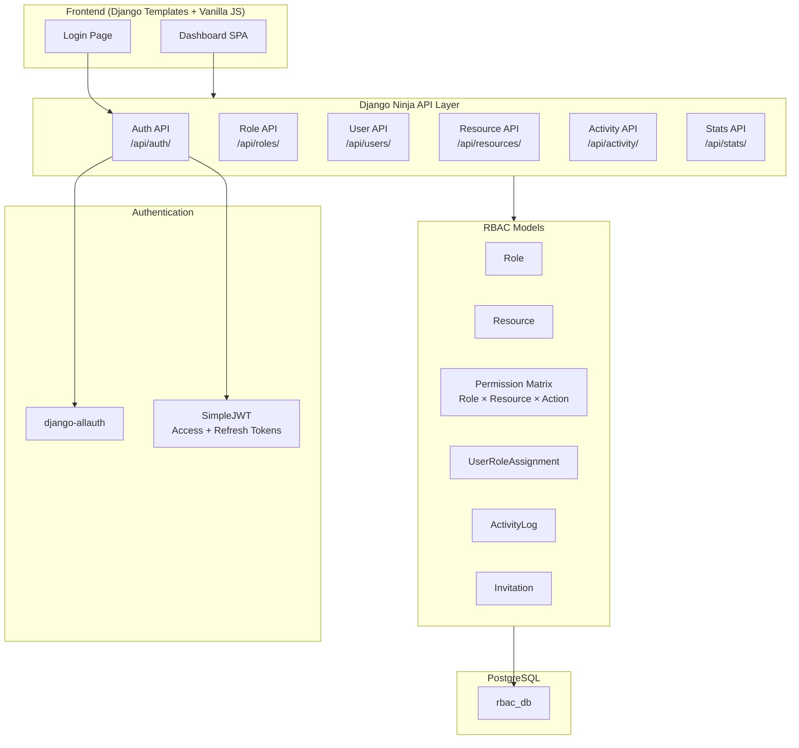
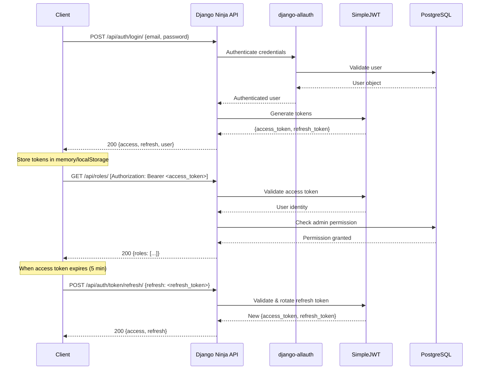

# RBAC System with Django Ninja, django-allauth, JWT Tokens & Admin Dashboard

## Background

Build a comprehensive Role-Based Access Control (RBAC) system with:
- **Backend**: Django + Django Ninja APIs + django-allauth + JWT (access/refresh tokens) + PostgreSQL
- **Frontend**: Premium admin dashboard served as Django templates (vanilla HTML/CSS/JS)
- **Package Manager**: `uv` (already installed v0.11.7)

## User Review Required

> [!IMPORTANT]
> **PostgreSQL Configuration**: The plan assumes PostgreSQL is running locally with default settings. Please confirm:
> - PostgreSQL is installed and running
> - Database name: `rbac_db` (will be created)
> - Username: `postgres` / Password: `postgres` (or provide your credentials)
> - Host: `localhost` / Port: `5432`

> [!IMPORTANT]
> **Project Location**: The project will be created at `d:\lms\` as a Django project named `rbac_project`.

## Open Questions

1. **PostgreSQL credentials**: What are your PostgreSQL username/password? (defaulting to `postgres`/`postgres`)
2. **Email backend**: Should user invitations send real emails or just log to console for development?
3. **Default admin user**: Should we create a superuser automatically during setup? (defaulting to yes with `admin`/`admin@example.com`/`admin123`)

---

## Architecture Overview



---

## Proposed Changes

### 1. Project Initialization & Configuration

#### [NEW] `d:\lms\pyproject.toml`
Project configuration with all dependencies:
- `django>=5.1`
- `django-ninja>=1.4`
- `django-allauth>=65.0`
- `djangorestframework-simplejwt>=5.4`
- `psycopg[binary]>=3.2` (PostgreSQL adapter)
- `django-cors-headers>=4.6`
- `python-decouple>=3.8` (env config)

#### [NEW] `d:\lms\.env`
Environment variables for database credentials, secret key, debug mode.

---

### 2. Django Project Structure

```
d:\lms\
├── pyproject.toml
├── .env
├── manage.py
├── rbac_project/
│   ├── __init__.py
│   ├── settings.py          # Django settings with allauth, ninja, JWT config
│   ├── urls.py               # Root URL config
│   └── wsgi.py
├── accounts/                  # Auth & User management app
│   ├── __init__.py
│   ├── models.py              # Custom User model (extends AbstractUser)
│   ├── api.py                 # Auth API endpoints (login, register, refresh, logout)
│   ├── schemas.py             # Pydantic schemas for auth
│   ├── admin.py
│   └── migrations/
├── rbac/                      # RBAC core app
│   ├── __init__.py
│   ├── models.py              # Role, Resource, Permission, UserRoleAssignment, ActivityLog, Invitation
│   ├── api.py                 # CRUD APIs for roles, resources, permissions, users, activity
│   ├── schemas.py             # Pydantic schemas for RBAC
│   ├── permissions.py         # Permission checking decorators/utilities
│   ├── signals.py             # Activity logging signals
│   ├── admin.py
│   └── migrations/
├── dashboard/                 # Frontend app
│   ├── __init__.py
│   ├── views.py               # Template views (login page, dashboard)
│   ├── urls.py
│   ├── templates/
│   │   └── dashboard/
│   │       ├── base.html
│   │       ├── login.html
│   │       └── index.html     # Main dashboard SPA
│   └── static/
│       └── dashboard/
│           ├── css/
│           │   └── styles.css  # Premium dashboard styles
│           └── js/
│               ├── app.js      # Main application logic
│               ├── auth.js     # Token management & API client
│               ├── roles.js    # Role management panel
│               ├── users.js    # User management panel
│               ├── stats.js    # System overview & charts
│               └── activity.js # Activity log panel
```

---

### 3. Backend Models (`rbac/models.py`)

#### Custom User Model (`accounts/models.py`)
- Extends `AbstractUser`
- Fields: `email` (unique), `avatar`, `is_active`, `date_joined`
- Email as primary login identifier

#### Role Model
- `name` (unique, max 100 chars)
- `description` (text, optional)
- `is_active` (boolean, default True)
- `created_at`, `updated_at` (auto timestamps)
- `created_by` (FK to User)

#### Resource Model
- `name` (unique, max 100 chars — e.g., "Articles", "User Profiles", "Settings")
- `description` (text, optional)
- `is_active` (boolean, default True)

#### Permission Model (The Matrix)
- `role` (FK to Role)
- `resource` (FK to Resource)
- `can_read` (boolean, default False)
- `can_write` (boolean, default False)
- `can_update` (boolean, default False)
- `can_delete` (boolean, default False)
- Unique constraint on `(role, resource)`

#### UserRoleAssignment Model
- `user` (FK to User)
- `role` (FK to Role)
- `assigned_at` (auto timestamp)
- `assigned_by` (FK to User)
- Unique constraint on `(user, role)`

#### Invitation Model
- `email` (email field)
- `roles` (M2M to Role)
- `invited_by` (FK to User)
- `status` (choices: "pending", "accepted", "expired")
- `token` (UUID, auto-generated)
- `created_at`, `expires_at`

#### ActivityLog Model
- `user` (FK to User)
- `action_type` (choices: "create_role", "edit_role", "delete_role", "assign_user", "revoke_role", "invite_user", "edit_permission", "deactivate_user", "login", "logout")
- `description` (text)
- `resource_affected` (varchar)
- `role_affected` (varchar, nullable)
- `ip_address` (GenericIPAddress, nullable)
- `created_at` (auto timestamp)

---

### 4. Backend API Endpoints

#### Auth API (`/api/auth/`)

| Method | Endpoint | Description | Validation |
|--------|----------|-------------|------------|
| POST | `/api/auth/register/` | Register new user | Email uniqueness, password strength (min 8 chars, mixed case, digit) |
| POST | `/api/auth/login/` | Login with email/password | Credential validation, account active check |
| POST | `/api/auth/token/refresh/` | Refresh access token | Valid refresh token required |
| POST | `/api/auth/logout/` | Blacklist refresh token | Authenticated only |
| GET | `/api/auth/me/` | Get current user profile | Authenticated only |

#### Roles API (`/api/roles/`) — Admin only

| Method | Endpoint | Description | Validation |
|--------|----------|-------------|------------|
| GET | `/api/roles/` | List all roles | Paginated, search by name |
| POST | `/api/roles/` | Create a new role | Name uniqueness, non-empty name |
| GET | `/api/roles/{id}/` | Get role details with permissions | Role exists |
| PUT | `/api/roles/{id}/` | Update role | Name uniqueness, role exists |
| DELETE | `/api/roles/{id}/` | Delete role | Role exists, not system role |
| POST | `/api/roles/{id}/permissions/` | Set permissions matrix | Valid resource IDs, valid booleans |

#### Resources API (`/api/resources/`) — Admin only

| Method | Endpoint | Description | Validation |
|--------|----------|-------------|------------|
| GET | `/api/resources/` | List all resources | Search by name |
| POST | `/api/resources/` | Create a new resource | Name uniqueness |
| PUT | `/api/resources/{id}/` | Update resource | Resource exists |
| DELETE | `/api/resources/{id}/` | Delete resource | Cascade permissions check |

#### Users API (`/api/users/`) — Admin only

| Method | Endpoint | Description | Validation |
|--------|----------|-------------|------------|
| GET | `/api/users/` | List all users with roles | Paginated, search, filter by role/status |
| GET | `/api/users/{id}/` | Get user details | User exists |
| POST | `/api/users/{id}/assign-role/` | Assign role to user | Valid role, not duplicate |
| POST | `/api/users/{id}/revoke-role/` | Revoke role from user | User has role |
| POST | `/api/users/{id}/deactivate/` | Deactivate user | User exists, not self |
| POST | `/api/users/{id}/activate/` | Activate user | User exists |
| POST | `/api/users/invite/` | Send invitation | Valid email, not existing user |

#### Stats API (`/api/stats/`) — Admin only

| Method | Endpoint | Description |
|--------|----------|-------------|
| GET | `/api/stats/overview/` | Total users, roles, active roles, pending invites |
| GET | `/api/stats/users-per-role/` | Bar chart data |
| GET | `/api/stats/roles-by-status/` | Pie chart data |

#### Activity API (`/api/activity/`) — Admin only

| Method | Endpoint | Description |
|--------|----------|-------------|
| GET | `/api/activity/` | Paginated activity log with search/filter |

---

### 5. Authentication Flow



**Token Configuration:**
- Access token lifetime: 5 minutes
- Refresh token lifetime: 24 hours
- Refresh token rotation enabled (new refresh token on each refresh)
- Blacklisting enabled for logout

---

### 6. Frontend Dashboard

The dashboard will be a single-page application served via Django templates, using vanilla JavaScript with `fetch()` for API calls. All API interactions use JWT bearer tokens.

#### Key Components:

**A. Sidebar Navigation**
- Dashboard (overview/stats)
- Roles (create/edit roles + permission matrix)
- Users (user directory + assignment)
- Activity Logs (audit trail)
- Settings (placeholder)

**B. System Overview Panel**
- Stat cards: Total Users, Total Roles, Active Roles, Pending Invites
- Bar chart: Users per Role (using Chart.js via CDN)
- Pie chart: Roles by Status

**C. Role Profiler Panel**
- Create/Edit form with name, description, status toggle
- Permission matrix table (Resource × Read/Write/Update/Delete)
- Select all per row/column
- Search/filter resources
- Save/Update/Cancel buttons

**D. User Directory Panel**
- Searchable, filterable table
- User avatars, roles (multi-badge), status badges
- Inline actions: View, Revoke Role, Deactivate, Manage Permissions
- Invite User modal

**E. Activity Log Panel**
- Timestamped audit trail table
- Filter by action type, date range, admin user
- Search functionality

#### Design System:
- **Colors**: Primary blue `#2563eb`, success green `#10b981`, danger red `#ef4444`, warning amber `#f59e0b`, dark `#1e293b`, light background `#f8fafc`
- **Typography**: Inter font (Google Fonts)
- **Effects**: Glassmorphism cards, smooth transitions (0.2s), hover effects, subtle shadows
- **Charts**: Chart.js 4.x via CDN

---

## Verification Plan

### Automated Tests
1. Run Django system checks: `python manage.py check`
2. Run migrations: `python manage.py migrate`
3. Verify all API endpoints with curl commands:
   - Register a user → Login → Get tokens → Access protected endpoints → Refresh token → Logout
4. Verify RBAC: Create roles, assign permissions, assign to users, check access
5. Run Django dev server and verify dashboard loads

### Manual Verification
1. Open dashboard in browser at `http://localhost:8000/`
2. Login with admin credentials
3. Walk through all dashboard panels:
   - Create a role with specific permissions
   - Create resources
   - Assign roles to users
   - Verify activity log captures all actions
   - Check stats/charts display correctly
4. Test token refresh flow (wait for expiry)
5. Test validation errors (duplicate names, invalid emails, etc.)
